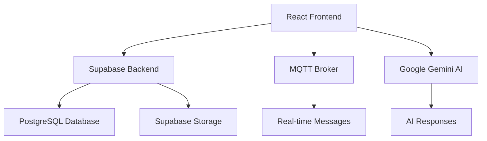

# 🚀 Relay AI - Next-Generation AI-Powered Messaging Platform

<div align="center">

</img>

**A modern, intelligent messaging platform that seamlessly integrates AI assistants with real-time human conversations**

[](https://opensource.org/licenses/MIT)
[](https://reactjs.org/)
[](https://www.typescriptlang.org/)
[](https://supabase.io/)
[](https://ai.google.dev/)

[🎯 Features](#-features) • [🚀 Quick Start](#-quick-start) • [📸 Screenshots](#-screenshots) • [🛠️ Tech Stack](#️-tech-stack) • [📖 Documentation](#-documentation)

</div>

---

## 📋 Table of Contents

- [✨ Overview](#-overview)
- [🎯 Features](#-features)
- [📸 Screenshots](#-screenshots)
- [🚀 Quick Start](#-quick-start)
- [🛠️ Tech Stack](#️-tech-stack)
- [🏗️ Architecture](#️-architecture)
- [📖 Documentation](#-documentation)
- [🤝 Contributing](#-contributing)
- [📄 License](#-license)

---

## ✨ Overview

**Relay AI** is a cutting-edge messaging platform that revolutionizes communication by seamlessly blending AI-powered assistance with real-time human conversations. Built with modern web technologies, it offers an intuitive, secure, and intelligent messaging experience that adapts to your communication style.

### 🎨 Key Highlights

- **🤖 AI-Powered Conversations**: Chat with multiple AI personas powered by Google Gemini 2.5 Pro
- **📱 Real-time Messaging**: Instant message delivery with MQTT protocol
- **📎 Rich File Sharing**: Support for images, documents, and multimedia with preview
- **🔐 Enterprise Security**: End-to-end encryption and privacy-first design
- **🌓 Modern UI/UX**: Clean, responsive interface with dark/light themes
- **📊 Smart Analytics**: Message insights and conversation analytics
- **🔄 Cross-Platform Sync**: Seamless synchronization across all devices

---

## 🎯 Features

### 💬 **Intelligent Messaging**
- **Multi-Persona AI Chat**: Interact with specialized AI assistants for different use cases
- **Smart Replies**: AI-powered response suggestions based on conversation context
- **Message Threading**: Organized conversation threads with reply chains
- **Real-time Typing Indicators**: Live typing status and read receipts

### 📎 **Advanced File Handling**
- **Universal File Support**: Share images, documents, videos, and audio files
- **Image Preview**: Fullscreen image viewer with zoom and download options
- **File Type Detection**: Smart file type recognition with appropriate icons
- **Cloud Storage**: Secure file storage with Supabase integration

### 👥 **Social Features**
- **Group Management**: Create and manage group conversations
- **Friend System**: Send/receive friend requests and manage contacts
- **User Profiles**: Customizable profiles with avatars and status
- **Contact Organization**: Pin important contacts and organize chats

### 🎨 **User Experience**
- **Modern Design System**: Clean, professional interface with smooth animations
- **Responsive Layout**: Optimized for desktop, tablet, and mobile devices
- **Theme Customization**: Dark/light mode with system preference detection
- **Accessibility**: Full keyboard navigation and screen reader support

### 🔐 **Security & Privacy**
- **Supabase Authentication**: Secure user authentication and session management
- **Row-Level Security**: Database-level security policies
- **Encrypted Storage**: Secure file storage with access controls
- **Privacy Controls**: Granular privacy settings and data protection

---

## 📸 Screenshots

<div align="start">

   ## Welcome Screen

*Clean, intuitive interface with organized chat list and AI assistant integration*


### 💬 **AI-Powered Conversations**

*Seamless AI conversations with rich message formatting and file attachments*


### 📱 **Mobile-First Design**

*Fully responsive design optimized for mobile and tablet devices*


</div>

---

## 🚀 Quick Start

### 📋 Prerequisites

- **Node.js** (v18 or higher)
- **npm** or **yarn**
- **Supabase** account
- **Google AI** API key (Gemini)

### 🔧 Installation

1. **Clone the repository**
   ```bash
   git clone https://github.com/mohdyasin4/relay-ai.git
   cd relay-ai
   ```

2. **Install dependencies**
   ```bash
   npm install
   ```

3. **Environment setup**
   ```bash
   cp .env.example .env
   ```

4. **Configure environment variables**
   ```env
   # Supabase Configuration
   VITE_SUPABASE_URL=your_supabase_url
   VITE_SUPABASE_ANON_KEY=your_supabase_anon_key
   VITE_SUPABASE_SERVICE_ROLE_KEY=your_service_role_key

   # Google AI Configuration
   GEMINI_API_KEY=your_gemini_api_key

   # Database Configuration
   DATABASE_URL=your_database_connection_string
   DIRECT_URL=your_direct_database_url

   # MQTT Configuration
   VITE_MQTT_BROKER_URL=your_mqtt_broker_url
   VITE_MQTT_USERNAME=your_mqtt_username
   VITE_MQTT_PASSWORD=your_mqtt_password
   ```

5. **Database setup**
   ```bash
   npx prisma generate
   npx prisma db push
   ```

6. **Start development server**
   ```bash
   npm run dev
   ```

7. **Visit** `http://localhost:5173` in your browser

---

## 🛠️ Tech Stack

### **Frontend**
- **[React 18](https://reactjs.org/)** - Modern UI library with hooks and concurrent features
- **[TypeScript](https://www.typescriptlang.org/)** - Type-safe JavaScript development
- **[Vite](https://vitejs.dev/)** - Fast build tool and development server
- **[Tailwind CSS](https://tailwindcss.com/)** - Utility-first CSS framework
- **[Framer Motion](https://www.framer.com/motion/)** - Production-ready motion library

### **Backend & Database**
- **[Supabase](https://supabase.io/)** - Backend-as-a-Service platform
- **[PostgreSQL](https://www.postgresql.org/)** - Robust relational database
- **[Prisma](https://www.prisma.io/)** - Next-generation ORM
- **[Row-Level Security](https://supabase.io/docs/guides/auth/row-level-security)** - Database security policies

### **AI & Intelligence**
- **[Google Gemini 2.5 Pro](https://ai.google.dev/)** - Advanced AI for conversations
- **[AI Vision](https://ai.google.dev/docs/vision)** - Image understanding capabilities
- **Smart Context Processing** - Contextual conversation understanding

### **Real-time & Communication**
- **[MQTT](https://mqtt.org/)** - Lightweight messaging protocol
- **WebSocket** - Real-time bidirectional communication
- **Push Notifications** - Cross-platform notification system

### **UI Components**
- **[Radix UI](https://www.radix-ui.com/)** - Headless UI components
- **[Shadcn/ui](https://ui.shadcn.com/)** - Modern component library
- **[Lucide Icons](https://lucide.dev/)** - Beautiful, customizable icons

---

## 🏗️ Architecture

### **📊 System Overview**



### **🔄 Data Flow**

1. **User Authentication** - Secure login through Supabase Auth
2. **Message Processing** - Real-time message delivery via MQTT
3. **AI Integration** - Contextual AI responses from Gemini
4. **File Management** - Secure file storage and retrieval
5. **State Management** - Optimized React state with custom hooks

---

## 📖 Documentation

### **🚀 Getting Started**
- [Installation Guide](docs/installation.md)
- [Configuration](docs/configuration.md)
- [Development Setup](docs/development.md)

### **🏗️ Development**
- [Project Structure](docs/project-structure.md)
- [Component Architecture](docs/components.md)
- [State Management](docs/state-management.md)
- [API Reference](docs/api.md)

### **🔧 Deployment**
- [Production Build](docs/deployment.md)
- [Environment Configuration](docs/environment.md)
- [Performance Optimization](docs/performance.md)

---

## 🤝 Contributing

We welcome contributions from the community! Please read our [Contributing Guidelines](CONTRIBUTING.md) before submitting a pull request.

### **Development Process**

1. **Fork** the repository
2. **Create** a feature branch: `git checkout -b feature/amazing-feature`
3. **Commit** changes: `git commit -m 'Add amazing feature'`
4. **Push** to branch: `git push origin feature/amazing-feature`
5. **Submit** a Pull Request

### **Code Standards**

- Follow TypeScript best practices
- Use conventional commit messages
- Maintain test coverage above 80%
- Follow accessibility guidelines

---

## 📄 License

This project is licensed under the **MIT License** - see the [LICENSE](LICENSE) file for details.

---

<div align="center">

**Made with ❤️ by the Relay AI Team**

[⭐ Star this repo](https://github.com/mohdyasin4/relay-ai) • [🐛 Report Bug](https://github.com/mohdyasin4/relay-ai/issues) • [💡 Request Feature](https://github.com/mohdyasin4/relay-ai/issues)

</div>

---

## 🏷️ Topics

`ai-chat` `messaging-app` `react` `typescript` `supabase` `gemini-ai` `real-time` `mqtt` `modern-ui` `file-sharing` `group-chat` `mobile-first` `responsive-design` `tailwindcss` `prisma` `postgresql` `authentication` `end-to-end-encryption` `dark-mode` `progressive-web-app`
